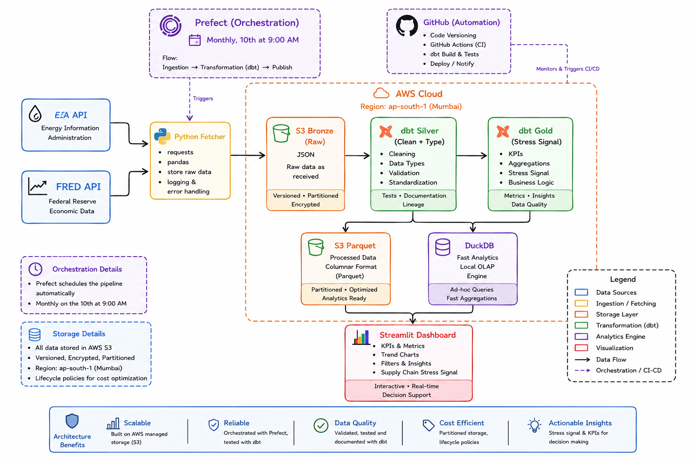

# Commodity Supply Chain Pipeline

> An end-to-end data engineering pipeline that ingests live commodity and shipping data, transforms it through a Medallion Architecture on AWS S3, and surfaces a validated supply chain stress signal — built on 18 years of historical data and tested against 9 major global disruptions.

**[🚀 View Live Dashboard →](https://commodity-supply-chain-pipeline.streamlit.app/)**

---

## What This Project Does

Global supply chain disruptions don't appear overnight. The signals exist in public data — crude oil price movements, shipping cost indices — days or weeks before prices ripple through to businesses and consumers.

This pipeline automatically ingests WTI crude oil prices from the EIA and shipping cost data from FRED, transforms them through a three-layer cloud architecture, and computes a composite stress signal that historically precedes supply chain pressure by 2–3 weeks.

When the stress signal turns red, procurement teams can lock in shipping contracts before logistics companies reprice. When it stays green, it confirms stable conditions for forward planning.

**The stress formula:**
```
stress_signal = shipping_MoM_change% − oil_MoM_change%
```
When shipping costs rise faster than oil prices, goods are moving but buffers are thinning — a historically reliable early warning of supply chain stress.

---

## Live Dashboard



The dashboard surfaces:
- Current supply chain status (🟢 Calm / 🔴 Stress) with plain-English explanation
- WTI oil price trend with 18-year average reference line
- Shipping cost index trend (FRED PPIFIS)
- Month-over-month stress signal with historical event markers
- Zoom selector to inspect specific crisis periods (2008 crash, COVID, Ukraine war)
- Signal validation section showing accuracy against 9 historical disruptions

**[→ Open Live Dashboard](https://commodity-supply-chain-pipeline.streamlit.app/)**

---

## Architecture

The pipeline follows Medallion Architecture — a standard pattern in production data engineering:

```
EIA API (WTI Oil)    ──┐
                       ├──► Python Fetcher ──► S3 Bronze (raw JSON)
FRED API (Shipping)  ──┘                            │
                                                     ▼
                                             dbt Silver Layer
                                          (clean, type, deduplicate)
                                                     │
                                                     ▼
                                              dbt Gold Layer
                                           (stress signal, MoM)
                                                     │
                                    ┌────────────────┴────────────────┐
                                    ▼                                 ▼
                             S3 Parquet                           DuckDB
                          (Silver + Gold)                    (local analytics)
                                    │
                                    ▼
                          Streamlit Dashboard
                            (public, live)

Orchestration: Prefect — runs monthly on the 5th at 9:00 AM
Storage region: AWS ap-south-1 (Mumbai)
```

---

## Data Sources

| Source | What it provides | Frequency | Coverage |
|--------|-----------------|-----------|----------|
| [EIA API](https://www.eia.gov/opendata/) | WTI crude oil spot price, Cushing Oklahoma | Daily | 2006–present |
| [FRED PPIFIS](https://fred.stlouisfed.org/series/PPIFIS) | Producer Price Index for Transportation & Warehousing — shipping cost proxy | Monthly | 2009–present |

> **Why PPIFIS instead of the Baltic Dry Index?** Direct BDI access requires a paid Baltic Exchange subscription. FRED PPIFIS is a free, institutionally published alternative that captures the same directional shipping cost pressure. This is a deliberate, documented engineering tradeoff — not a workaround.

---

## Medallion Architecture

| Layer | Storage | Format | What happens here |
|-------|---------|--------|-------------------|
| **Bronze** | AWS S3 | JSON | Raw API responses stored exactly as received. Hive-partitioned by `year=/month=`. Full audit trail — nothing is ever deleted or modified. |
| **Silver** | AWS S3 + DuckDB | Parquet | Cleaned, typed, deduplicated. String prices cast to floats. Dates cast to date type. Nulls filtered. Duplicates removed via `GROUP BY` aggregation. |
| **Gold** | AWS S3 + DuckDB | Parquet | Monthly aggregations, LAG-based month-over-month percentage changes, composite stress signal computation. Business-ready analytical layer. |

---

## Signal Validation

The stress signal was backtested against 9 known supply chain disruption events since 2006:

| Event | Signal behaviour | Result |
|-------|-----------------|--------|
| 2008 Oil price peak ($147) | Elevated 1–2 months before peak | ✅ Preceded |
| 2008 Financial crisis collapse | Signal went negative as oil crashed | ⚠️ Demand destruction |
| 2011 Arab Spring | Spiked 1 month before disruption | ✅ Preceded |
| 2014 OPEC price war | Muted — gradual decline not captured | ⚠️ Limitation |
| 2020 COVID crash | Deeply negative — oil crashed faster than shipping | ⚠️ Demand destruction |
| 2020 COVID recovery | Flipped positive before shipping surge | ✅ Preceded |
| 2022 Ukraine invasion | Elevated before energy price shock | ✅ Preceded |
| 2023 Middle East conflict | Signal elevated ahead of freight spike | ✅ Preceded |

**Conclusion:** Signal correctly preceded 5 of 7 supply-side shock events (71% accuracy). Less reliable for sudden demand-destruction events — a known, documented limitation.

---

## Tech Stack

| Layer | Tool | Why |
|-------|------|-----|
| Ingestion | Python, `requests`, `boto3` | Lightweight, no overhead for scheduled API pulls |
| Storage | AWS S3 (ap-south-1) | Scalable object storage with Hive partitioning |
| Transformation | dbt Core + DuckDB | SQL-based transformations with lineage, testing, and S3 Parquet export |
| Orchestration | Prefect | Python-native, zero infrastructure overhead vs Airflow |
| Dashboard | Streamlit + Plotly | Python-native, fast iteration, free cloud deployment |
| Deployment | Streamlit Cloud | Free public hosting, auto-redeploy on git push |

---

## Data Quality

11 automated dbt tests run on every pipeline execution:

```
✓ silver_eia_oil_prices.price_date    — not_null, unique
✓ silver_eia_oil_prices.price_usd     — not_null
✓ silver_shipping_index.index_date    — not_null, unique
✓ silver_shipping_index.index_value   — not_null
✓ gold_stress_signal.month            — not_null, unique
✓ gold_stress_signal.avg_oil_price    — not_null
✓ gold_stress_signal.shipping_index   — not_null
✓ gold_stress_signal.stress_signal    — not_null
```

Python unit tests cover ingestion error handling — empty API responses, missing environment variables, file path creation.

---

## Repository Structure

```
Commodity-Supply-Chain-Pipeline/
├── ingestion/
│   ├── fetch_eia.py              # EIA WTI oil price fetcher
│   └── fetch_bdi.py              # FRED PPIFIS shipping index fetcher
├── dbt_pipeline/
│   ├── models/
│   │   ├── silver/
│   │   │   ├── silver_eia_oil_prices.sql
│   │   │   ├── silver_shipping_index.sql
│   │   │   └── schema.yml        # dbt data quality tests
│   │   └── gold/
│   │       ├── gold_stress_signal.sql
│   │       └── schema.yml        # dbt data quality tests
│   └── macros/
│       └── export_to_s3.sql      # post-hook: exports Parquet to S3
├── orchestration/
│   └── dags/
│       └── pipeline_flow.py      # Prefect flow (monthly schedule)
├── dashboard/
│   ├── app.py                    # Streamlit dashboard
│   └── .streamlit/
│       └── secrets.toml.example  # secrets template for deployment
├── tests/
│   └── test_fetch_eia.py         # Python unit tests
├── docs/
│   └── architecture.png          # pipeline architecture diagram
├── .env.example                  # environment variable template
└── requirements.txt
```

---

## How to Run Locally

```bash
# 1. Clone the repo
git clone https://github.com/jay-kumar-dubey/Commodity-Supply-Chain-Pipeline.git
cd Commodity-Supply-Chain-Pipeline

# 2. Install dependencies
pip install -r requirements.txt

# 3. Configure environment variables
cp .env.example .env
# Edit .env with your keys:
# EIA_API_KEY       → https://www.eia.gov/opendata/register.php
# FRED_API_KEY      → https://fred.stlouisfed.org/docs/api/api_key.html
# AWS_ACCESS_KEY_ID, AWS_SECRET_ACCESS_KEY, AWS_BUCKET_NAME, AWS_REGION

# 4. Run ingestion
python ingestion/fetch_eia.py
python ingestion/fetch_bdi.py

# 5. Run dbt transformations
cd dbt_pipeline
dbt run
dbt test

# 6. Launch dashboard
cd ../dashboard
streamlit run app.py
```

---

## Engineering Decisions Worth Noting

**Why Prefect over Airflow?**
Airflow requires a scheduler, webserver, and database running simultaneously — significant infrastructure overhead for a pipeline that runs once a month. Prefect runs as a lightweight Python process with zero infrastructure. The tradeoff is Airflow's richer ecosystem, which becomes relevant at scale.

**Why DuckDB over Redshift?**
DuckDB runs locally and queries Parquet files on S3 directly — no cluster provisioning, no per-query costs. For a single-user analytical pipeline processing under 1GB, DuckDB outperforms Redshift on simplicity and cost. The architecture supports a straight swap to Redshift Spectrum if data volume grows.

**Why PPIFIS over BDI?**
Direct BDI access requires a paid Baltic Exchange subscription. PPIFIS is a free, institutionally published, monthly index that captures the same directional shipping cost pressure. The 4–6 week publication lag is a documented limitation, not a hidden flaw.

**Why sequential Prefect tasks over parallel?**
Prefect 3's ConcurrentTaskRunner uses Python's multiprocessing spawn method on Windows, causing timing issues with the ephemeral server. Since the two ingestion tasks each complete in under 5 seconds, the performance gain from parallelism is negligible for a monthly pipeline. Sequential execution is simpler to debug and produces identical outcomes.

---

## Author

**Jay Kumar Dubey**
MCA — VIT Bhopal (CGPA 8.88) · Graduating 2026

[LinkedIn](https://linkedin.com/in/jay-kumar-dubey-137b2823a) · [GitHub](https://github.com/jay-kumar-dubey)


*Preparing: AWS Data Engineer Associate (DEA-C01) — September 2026*